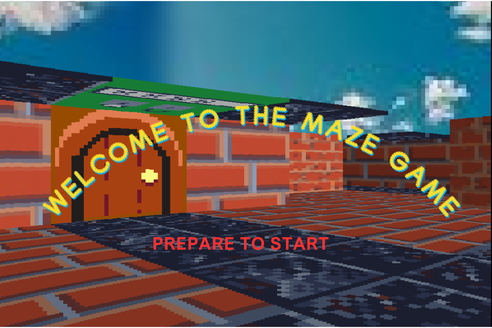
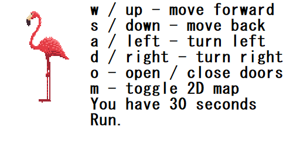
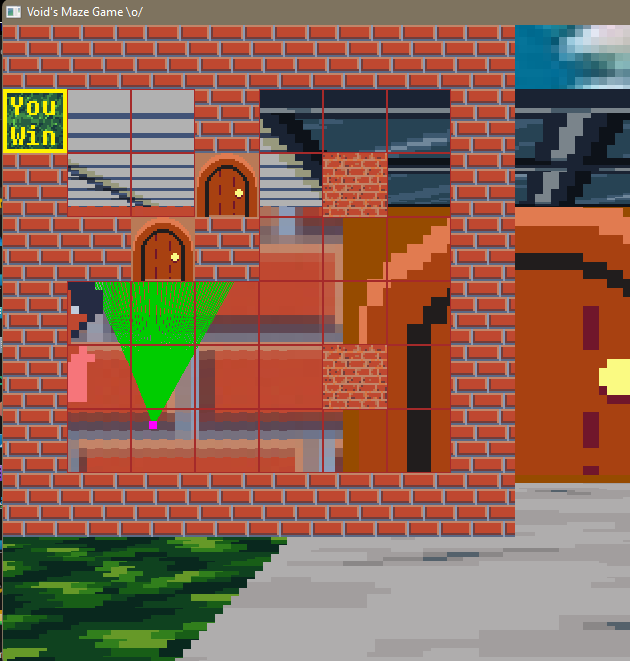
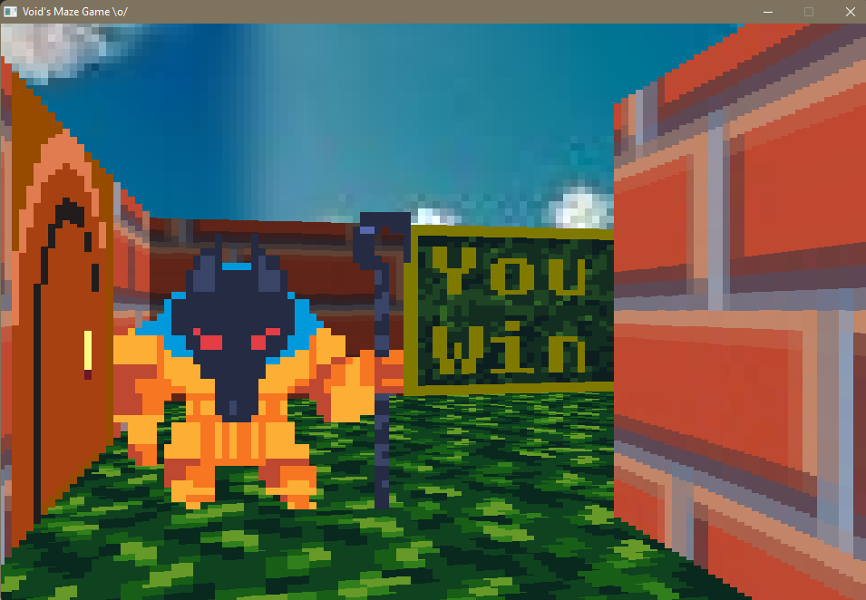
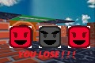
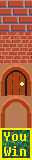
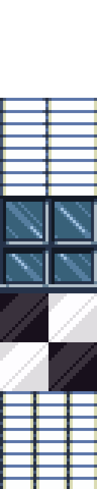

# The Maze

This is the MVP for my solo portfolio project.

You can play the maze game by downloading [The Maze](The%20Maze/) on your pc and running the file [maze.exe](The%20Maze/maze.exe). Please do not delete any of the other files or apps in this folder.

If you want to run the program on a unix system, download and run this script [install_SDL2](install_SDL2.sh) to install SDL2 required extensions on your terminal, then you can run the compiled executable [maze](maze) to have your fun.

This is a game with relatively simple controls, and with an even simpler objective, which is to reach the goal in under 30 seconds.

The win objective might be confusing while opening the game for the first time, so here's a 2D map of the game, which can be toggled at any time!

The mini Anubis guard serves to make the win a little less easy than it seems though.

If you get caught by the guard or you run out of time, the game automatically ends, and you restart immediately!

A peek of the different textures available for the map/walls, ceiling and floor in this version...

These textures haave been converted to an array of integers, to be compiled and displayed in the game. In this file [src](src/), you can find the arrays of more textures that can be used during recompilation, the source files for my code, and the makefile.
