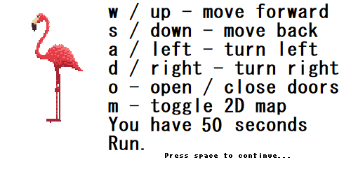
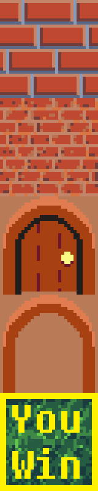

# The Maze

These are the links to my articles on LinkedIn and Twitter, please engage them:

[Linkedin](https://www.linkedin.com/posts/tolu-otayomi-319330289_alxabrse-activity-7206872385457688576-fY9Z)

[Twitter/X](https://x.com/OtayomiTolu/status/1801112947009163449)

	This is the MVP for my solo portfolio project.

At the end of April, I was struggling to decide on what to build for my portfolio project and teammates to work on it with. I had known for a while that whatever I decide to build, my involvement in the project should be mostly backend, as I am much more interested in writing the development code than in designing the user interactive platform.

	This is a game with relatively simple controls and with
	an even simpler objective, which is to reach the goal
	in under 30 seconds.

Unfortunately, my group of study mates had already teamed up with each other and I was the final wheel. I was left with no concrete plan, and no one to work with. I could have teamed up with other random peers, but I've had enough experiences with carrying the bulk of collaborative work, especially with peers whose capabilities I could not be privy to, or trust.

	The win objective might be confusing while opening the
	game for the first time, so here's a 2D map of
	the game, which can be toggled at any time!

On 2nd may, alongside the suggestions of projects to build, I came across the truly ridiculous fallback option that was suggested, which was to build a game, an actual game, using C! I couldn't believe my eyes and I could not even begin to fathom how to even begin such an endevour, but I knew immediately that even though I had not the slightest idea how to begin, this was it. This is the chalenge I'd been looking for. This was what I wanted to build.

	The mini Anubis guard serves to make the win a little
	less easy than it seems though.

I had a really hard time finding the right resources to help me understand the concept of raycasting and how it works, and it wasn't until 20th may that I could begin building anything but I spent the time between exploring and finding my way around an unfamliar SDL2. After scouring the internet, I finally found a youtuber who actually explained the step by step process of Raycasting, but he was doing so using Open GL which is another game development library.

	If you get caught by the guard or you run out of time,
	the game automatically ends, and you restart immediately!

Essentially, I spent my time learning how to raycast, how to use OpenGL, and then replicating those functions over in a different SDL2, which would not have been possible without my time learning how to use it for different functions. I got to learn how to use structs properly, how and when to make use of different kinds of global variables, how to compile and run my executable programs on not only unix terminals, but windows too.

Most importantly, I have learned patience, perseverance, how to debug using the best debugging tool (printf) and to never ever mess with unallocated memory and uninitialized pointers and pointer functions as you can save yourself a lot of SEGFAULT errors which you cannot seem to trace in the middle of a thousand lines of code.

You can play the maze game by downloading [The Maze](The%20Maze/) on your pc and running the compiled executable [maze.exe](The%20Maze/maze.exe). Please do not delete any of the other files or apps in this folder.

If you intend to run the program on a unix system, download and run this script [install_SDL2](The%20Maze/install_SDL2.sh) to install SDL2 required extensions on your terminal, then you can run the file [maze](The%20Maze/maze) to have your fun.

A peek of the different textures available for the map/walls, ceiling and floor in this version...

These textures have been converted to an array of integers, to be compiled and displayed in the game. In this file [src](src/), you can find the arrays of more textures that can be used during recompilation, the source files for my code, and the makefile.

Latest Updates:
Added new levels to prepare you before the main stage:
Details:
- Added new textures
- Created a new tech maze stage
