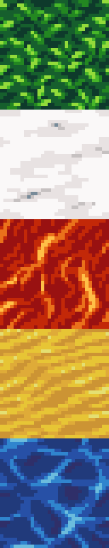

# The Maze

This is the MVP for my portfolio project.

You can play the maze game by downloading [The Maze](The%20Maze/) on your pc and running the file [maze.exe](The%20Maze/maze.exe). Please do not delete any of the other files or apps in this folder.

If you want to run the program on a unix system, download and run this script [install_SDL2](install_SDL2.sh) to install SDL2 required extensions on your terminal, then you can run the compiled executable [maze](maze) to have your fun.
